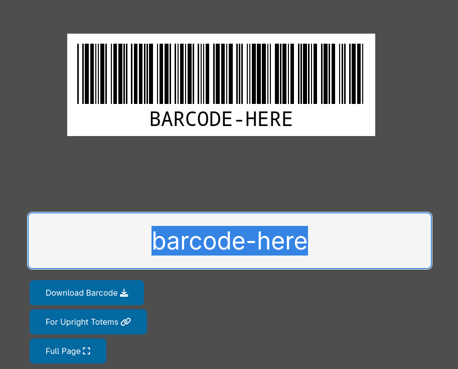

# Barcode Generator

A lightweight, client-side, zero-dependency barcode generator utility built with HTML, CSS, and vanilla JavaScript. It uses the `JsBarcode` library to render and download standard CODE39 barcodes as SVG format.

## Features

- **Single Barcode Generation** (`index.html`): Standard interface for creating and downloading individual barcodes.
- **Multiple Barcodes for Upright Totems** (`totems.html`): Allows pasting multiple values separated by spaces (e.g. from spreadsheet columns) to generate a sequence of barcodes at once.
- **Full Page Layout** (`large.html`): Configured specifically with large dimensions (11 x 8.5 inches at 96 DPI) and customized SVG text sizes for use in software like LibreOffice.
- **Pure Client-Side**: No backend, no trackers, runs entirely in the browser.

## Tech Stack

- HTML5
- CSS3 (Vanilla)
- JavaScript (ES6)
- Libraries:
  - [JsBarcode](https://github.com/lindell/JsBarcode) (loaded via CDN)
  - [FontAwesome](https://fontawesome.com/) (loaded via CDN for icons)

## Usage

1. Open `index.html` in any web browser.
2. Enter the barcode text and press **Enter**.
3. View the generated barcode on the screen.
4. Click **Download Barcode** to save the barcode as an `.svg` file.
