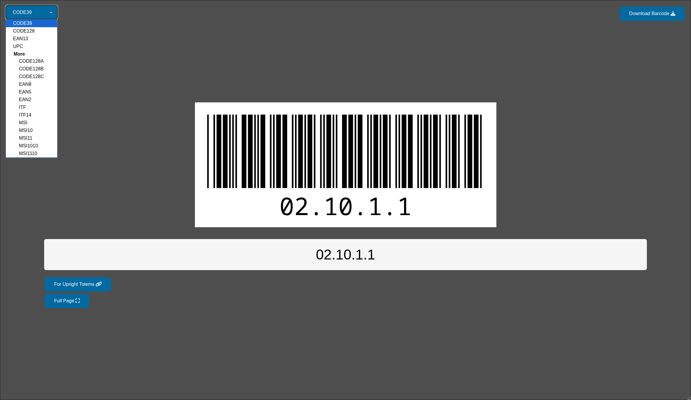
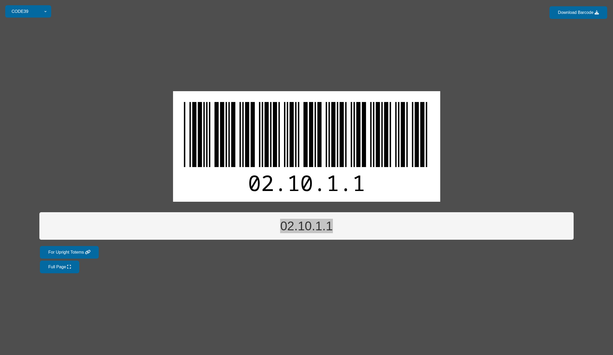
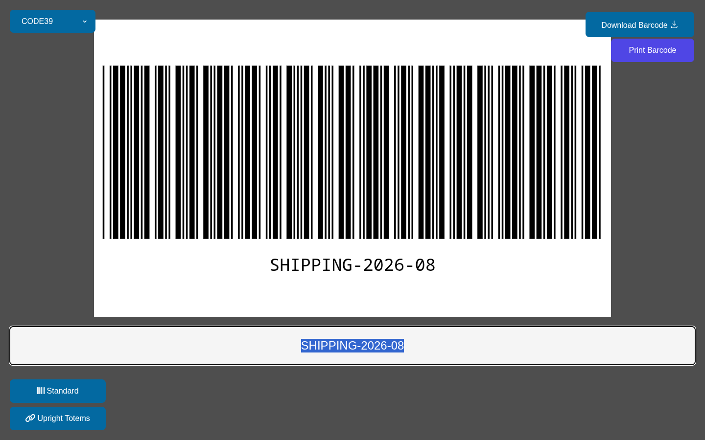
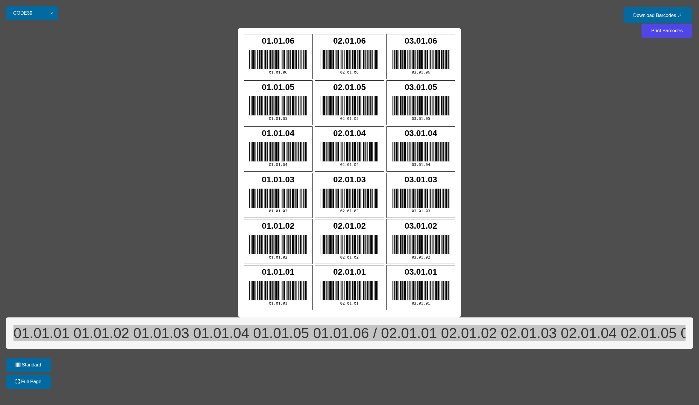
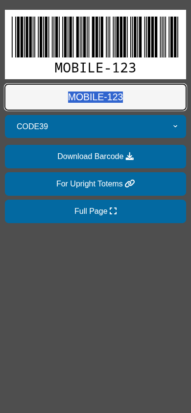

# Barcode Generator

A lightweight, client-side barcode generator built with HTML, CSS, and vanilla JavaScript. It uses [JsBarcode](https://github.com/lindell/JsBarcode) to render multiple barcode formats as SVGs, ready to print or download.



## Features

- **Single Barcode Generation** (`index.html`): Enter one value, pick a barcode format, and download or print.
- **Rack Totem Labels** (`totems.html`): Generate a full 8.5×11 sheet of barcodes organized in three columns. Values stack bottom-to-top within each column. Use `/` to start a new column.
- **Full Page Barcode** (`large.html`): Produce a single large landscape barcode sized for 11×8.5 printing.
- **Multiple Barcode Formats**: CODE39 (default), CODE128, EAN13, UPC, and more via a dropdown selector.
- **Print and Download**: Save as SVG, or print directly from the browser with print-optimized layouts.
- **Mobile Friendly**: Responsive layouts work on desktop and mobile.

## Tech Stack

- HTML5
- CSS3
- JavaScript (ES6)
- [JsBarcode](https://github.com/lindell/JsBarcode) (via CDN)
- [FontAwesome](https://fontawesome.com/) (via CDN)

## Usage

1. Open `index.html`, `totems.html`, or `large.html` in any web browser.
2. Enter a barcode value and press **Enter**.
3. Select a barcode format from the dropdown.
4. Click **Download Barcode(s)** or **Print Barcode(s)**.

### Rack Totem Format

In `totems.html`, separate bins with spaces and use `/` to start a new column:

```
01.01.01 01.01.02 01.01.03 / 02.01.01 02.01.02 02.01.03 / 03.01.01 03.01.02 03.01.03
```

This generates three columns with the first value of each column printed at the bottom so labels can be read upright when wrapped around a rack post.

## Screenshots

| Standard | Full Page | Rack Totems | Mobile |
|----------|-----------|-------------|--------|
|  |  |  |  |

## License

MIT
